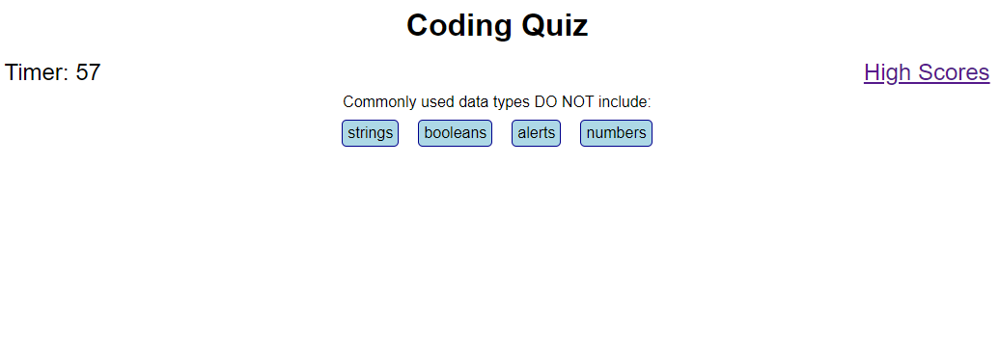

# Coding Quiz

## Website Link
<https://griveroll86.github.io/quiz/index.html>

## Multiple Choice Coding Quiz
This assignment asked us to create a timed quiz with multiple choice questions and dynamically updated HTML and CSS using Javascript. Correct answers award +1 to the score and incorrect answer reduce the time remaining by 5 seconds. After the quiz you can enter your name to be stored in a list.

## Files Edited
* index.html and highscores.html
* style.css
* script.js and highscoresScript.js

## Preview Image
